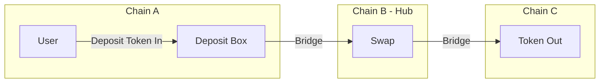

# Cross-Chain Swap (Intent-Based)

This is an alternative to the default [bridge-swap-bridge-back flow](./README.md). Instead of manually orchestrating three separate steps, this flow uses Pendle's **Cross-Chain Swap API** to handle everything as a single **intent** managed by Pendle's backend.

## How it works

The user deposits tokens into a deposit box on chain `A`. Pendle's backend handles bridging to chain `B` (hub), swapping, and delivering the output token to chain `C`.



<details>
<summary>

### How it works (step by step)

</summary>

#### Step 1 — Simulate

Calls the simulate API to get a quote: expected output, fees, time estimates, and the deposit box address.

The quote is valid for 15 seconds. If the user takes longer to confirm, the script automatically re-simulates.

#### Step 2 — Challenge + Sign (SIWE)

Generates a SIWE (Sign-In With Ethereum) challenge message from the backend, which the user signs with their wallet. This binds the intent to the user's address.

#### Step 3 — Submit Intent

Submits the intent to the backend with the simulation data and signed challenge. The backend returns an intent ID and fund data (which token, how much, on which chain to deposit).

#### Step 4 — Deposit

Transfers the required tokens to the deposit box address on chain A. The script checks the deposit box balance first — if it already has sufficient funds (e.g. from a previous partial attempt), it skips the transfer. After the transfer confirms on-chain, it notifies the backend via the confirm-deposit API.

#### Step 5 — Poll + Completion

Polls the intent status with exponential backoff (5s → 15s) until a terminal state is reached:

- **completed** — output token delivered to chain C
- **refunded** — deposit returned to user
- **cancelled** — intent was cancelled
- **failed** — if retryable or cancellable, the user is prompted to choose an action

</details>

## Usage

### Environment

Copy `.env.example` to `.env` and fill in the parameters.

- Chain `A` is the **source chain** (where the user deposits tokens).
- Chain `B` is the **hub chain** (where the Pendle market and swap happen).
- Chain `C` is the **destination chain** (where the user receives the output token).

```sh
PRIVATE_KEY=0xYourPrivateKey

RAW_AMOUNT=15000000000000000000 # 15 * 10**18
SLIPPAGE=0.005 # 0.5%

A_RPC_URL=https://rpc-url-for-source-chain
B_RPC_URL=https://rpc-url-for-hub-chain
C_RPC_URL=https://rpc-url-for-destination-chain

A_TOKEN_IN=0xYourTokenIn    # token to deposit on chain A (e.g. bridged PT address)
B_MARKET=0xYourMarketAddress # Pendle market address on chain B
C_TOKEN_OUT=0xYourTokenOut   # token to receive on chain C (e.g. USDC)

# Optional
BRIDGE_ROUTE_PRIORITY=BEST_RETURN # BEST_RETURN (default) or FASTEST
PENDLE_API_BASE_URL=https://api-v2.pendle.finance/core # defaults to this value
```

### Running the swap

```sh
yarn cross-chain-swap
```

The script will:
1. Display a simulation quote and prompt for confirmation
2. Ask you to sign a SIWE challenge message
3. Submit the intent and show the intent ID
4. Display the deposit transaction details and prompt for confirmation
5. Poll until the intent reaches a terminal state

Confirmations can be skipped with `NO_CONFIRM=1` (except for retry/cancel prompts on failure, which always require user input).

```sh
NO_CONFIRM=1 yarn cross-chain-swap
```

### Listing intents

```sh
yarn list-intents              # lists PENDING intents (default)
yarn list-intents 0 20         # with skip and limit
```

Displays a table of your intents with intent ID, action type, status, overall state, and tokens.

### Continuing an existing intent

If the script was interrupted (e.g. after submitting the intent but before depositing), you can resume it:

```sh
yarn continue-intent <intentId>
```

The script fetches the intent state and picks up where it left off:
- If **awaiting deposit** — continues from the deposit step
- If **processing** — continues polling
- If **failed** — prompts for retry or cancel
- If **completed/refunded/cancelled** — displays the result
