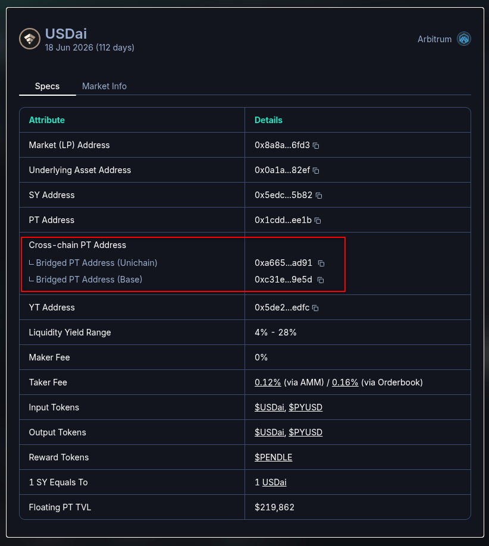

# pt-bridger

This script helps performing the bridging and swapping PT with another token. Basically it allows to do the following actions sequentially, in one go:

- Bridge PT from chain `A` to chain `B` (via LayerZero natively);
- Swap PT to another token on chain `B` (via PendleRouter);
- Bridge the token from chain `B` back to chain `A` (via Bungee).

## Why is this needed?

Pendle deploys PT (Principal Token) on a **native chain** (e.g. Arbitrum), but also provides **bridged PTs** on other chains (e.g. Unichain) via LayerZero's OFT (Omnichain Fungible Token) standard. The bridged PT cannot be swapped directly on the non-native chain because the Pendle Router and liquidity only exist on the native chain. Therefore, a round-trip is required:

```
Chain A (Bridged PT)                          Chain B (Original PT)
┌──────────────┐    LayerZero OFT bridge     ┌──────────────────────┐
│ Bridged PT   │ ──────────────────────────> │ Original PT          │
└──────────────┘         Step 1              │         │            │
                                             │         │            │
                                             │   Pendle Convert API │
                                             │         │            │
                                             │         V            │
┌──────────────┐    Bungee bridge            │ Output Token (e.g.   │
│ Token (e.g.  │ <────────────────────────── │ USDC)                │
│ USDC)        │         Step 3              └──────────────────────┘
└──────────────┘                                    Step 2
```

<details>
<summary>

### How it works (step by step)

</summary>

#### Step 1 — Bridge PT from chain A to chain B (`bridgePt`)

1. Looks up the destination chain's OFT peer address using the LayerZero metadata API.
2. Calculates the minimum acceptable amount after slippage (`rawAmount * (1 - slippage)`).
3. If the PT is a wrapped token, approves the OFT contract as spender.
4. Calls `quoteSend()` on the OFT contract to estimate the native gas fee.
5. Simulates and then executes the `send()` transaction on the OFT contract, paying the quoted fee.
6. Polls the LayerZero Scan API until the cross-chain message status is `DELIVERED` (with exponential backoff).
7. Returns the actual amount sent (may differ from `rawAmount` due to dust/fees).

#### Step 2 — Swap PT to token on chain B (`pendleSwapPtToToken`)

1. **Approval** — Checks the PT token allowance for the Pendle Router (`0x888888888889758F76e7103c6CbF23ABbF58F946`). If insufficient, sends an approval transaction. Throws if the wallet balance is insufficient or the user cancels.
2. **Route Discovery** — Builds a convert request body (with inputs, outputs, slippage, aggregator and limit order settings) and calls the Pendle Convert API to find the best swap route.
3. **Swap Execution** — Logs the estimated output amount, asks for user confirmation, then sends the on-chain transaction returned by the API. Waits for the transaction receipt.
4. **Result** — Measures the actual token output by comparing the receiver's token balance before and after the swap, and returns it as `rawAmountTokenOut`.

#### Step 3 — Bridge token from chain B back to chain A (`bridgeTokenViaBungee`)

1. Fetches a quote from the Bungee API with the token amount, source/destination chains, and slippage.
2. If the token has not been approved for Bungee's Permit2 contract (`0x000000000022D473030F116dDEE9F6B43aC78BA3`), sends an approval transaction.
3. Signs a Permit2 request using EIP-712 typed data (the signature data comes from the quote response).
4. Submits the signed request to Bungee.
5. Polls the Bungee status API until the request is `FULFILLED` or `SETTLED` (with exponential backoff). Fails if `CANCELLED`, `EXPIRED`, or `REFUNDED`.
6. The output token arrives in the wallet on chain A.

</details>

# Demo


# Usage

## Installation

Clone this repo. Run

```sh
yarn install
```

## Filling parameters in the environment

Copy `.env.example` to `.env` and fill in the parameters.

- Note that the parameters uses the naming convention for chain `A` and chain `B`.
    - Chain `A` is where the **bridged** PT is deployed.
    - Chain `B` is where the **original** PT is deployed.
- `PRIVATE_KEY` is used to derive your account on both chain `A` and chain `B` to.
    - All tokens are sent to your account in every action.
- `RAW_AMOUNT` is the amount of bridged PT you want to swap, in wei.
    - Foundry command like `cast to-wei` and `cast to-unit` is helpful to convert between units.

An example of an `.env` file for bridging and swapping bridged 15 PT USDai (2026JUN) on **unichain** to USDC.

```sh
PRIVATE_KEY=0xYourPrivateKey

RAW_AMOUNT=15000000000000000000 # 15 * 10**18 (as the PT has 18 decimals)
SLIPPAGE=0.005 # 0.5%

A_RPC_URL=https://rpc-url-for-unichain
A_OFT=0xa6656e5456809b028c05531ad20dc2897b4dad91 # bridged PT address on unichain
A_TOKEN=0x078D782b760474a361dDA0AF3839290b0EF57AD6 # usdc on unichain

B_RPC_URL=https://rpc-url-for-arbitrum # arbitrum is where the original PT USDai (2026JUN) is deployed
B_TOKEN=0xaf88d065e77c8cC2239327C5EDb3A432268e5831 # usdc on arbitrum
```

### Where to find the addresses

- The bridge PT address can be found directly on Pendle APP:

| Click the `Specs` button                                  | See the addresses                                                 |
| --------------------------------------------------------- | ----------------------------------------------------------------- |
|  |  |

- The full list of tokens that is supported by Bungee can be found via Bungee's API: https://public-backend.bungee.exchange/api/v1/tokens/list

## Running the script

```sh
yarn bridge-pt-swap-bridge-back
```

This command will read the `.env` file and execute the bridge, swap, and bridge back in order.

Please note that the script **prompts** you for confirmation at every steps. If you wish to run this script without any confirmation, set the environment variable `NO_CONFIRM=1`:

```sh
NO_CONFIRM=1 yarn bridge-pt-swap-bridge-back
```

## Failure recovery/Running each steps individually

If you wish to run each steps individually to confirm the result of each steps, or to **recover from failure** from the main script `bridge-pt-swap-bridge-back`, run the following commands.

```sh
# Bridge pt from chain A to chain B
yarn bridge-pt

# swap pt to token on chain B
yarn pendle-swap-pt-to-token

# bridge token from chain B back to chain A
yarn bridge-token-via-bungee
```

These scripts are designed to be simple for recovery, therefore it will not save immediate values anywhere. They only rely on the `.env` file and the current blockchain state:

- `bridge-pt` and `pendle-swap-pt-to-token` will use `RAW_AMOUNT` as the amount to bridge/swap.
- `bridge-token-via-bungee` will **NOT** use `RAW_AMOUNT`. Instead, it will bridge **ALL** balance of token. Proceed with caution, and confirm the script's prompts at every step.

# Known issues

- Bungee will not produce any routes if the bridge amount is too small (< 1$). Check your bridging amount first.
